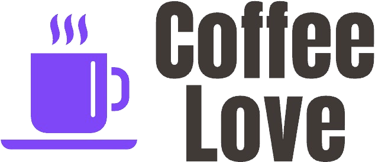

# Coffee Love ❤️

  

  
  
  
  

**Uma aplicação web deliciosa para os entusiastas do café!**

Coffee Love é uma aplicação web moderna, construída com React, projetada para conectar amantes de café e proporcionar a eles uma experiência agradável e intuitiva. Seja você um barista experiente ou apenas começando sua jornada no mundo do café, o Coffee Love tem algo para todos.

## ✨ Funcionalidades

*   **Interface Bonita e Intuitiva:** Desfrute de um design limpo e moderno que torna a navegação no aplicativo muito fácil.
*   **Design Responsivo:** Funciona perfeitamente em desktops, tablets e dispositivos móveis.
*   **Gerenciamento Robusto de Formulários:** Utiliza `react-hook-form` e `zod` para um gerenciamento de formulários eficiente e validado, garantindo a integridade dos dados.
*   **Animações Suaves:** Experiência do usuário aprimorada com animações `framer-motion`, tornando a interação mais dinâmica e agradável.
*   **Chakra UI:** Construído com o poder do Chakra UI, uma biblioteca de componentes que torna o desenvolvimento mais rápido, fácil e acessível.
*   **Ícones Lucide:** Ícones bonitos, consistentes e de alta qualidade com `lucide-react`.
*   **Axios:** Para todas as requisições à API, facilitando a comunicação com serviços externos.
*   **React Router Dom:** Para todas as rotas, permitindo uma navegação fluida e organizada entre as diferentes seções do aplicativo.

## 🚀 Tecnologias Utilizadas

Este projeto foi construído utilizando as seguintes tecnologias:

*   **React:** Uma biblioteca JavaScript para construção de interfaces de usuário, conhecida por sua eficiência e flexibilidade.
*   **TypeScript:** Um superset do JavaScript com tipagem estática, que ajuda a prevenir erros e melhorar a qualidade do código.
*   **Vite:** Uma ferramenta de build extremamente rápida para desenvolvimento web moderno, proporcionando um ambiente de desenvolvimento ágil.
*   **Chakra UI:** Uma biblioteca de componentes simples, modular e acessível, que acelera o desenvolvimento e garante consistência visual.
*   **React Hook Form:** Para gerenciamento de formulários de forma eficiente e declarativa.
*   **Zod:** Para validação de esquemas, garantindo a integridade dos dados e a robustez da aplicação.
*   **Framer Motion:** Para animações fluidas e expressivas, melhorando a experiência do usuário.
*   **Lucide React:** Para a utilização de ícones vetoriais de alta qualidade e consistência.
*   **Axios:** Para requisições HTTP, facilitando a comunicação com APIs externas.
*   **React Router Dom:** Para gerenciamento de rotas, permitindo uma navegação organizada e intuitiva.
*   **@hookform/resolvers:** Para integrar o Zod com o React Hook Form.
*   **@emotion/react e @emotion/styled:** Para estilização dos componentes do Chakra UI.

## 📸 Capturas de Tela

## 📜 Licença

Este projeto está licenciado sob a Licença MIT - veja o arquivo `LICENSE` para detalhes.

## ❤️ Mostre Seu Apoio

Dê uma ⭐️ se você gostou deste projeto!
